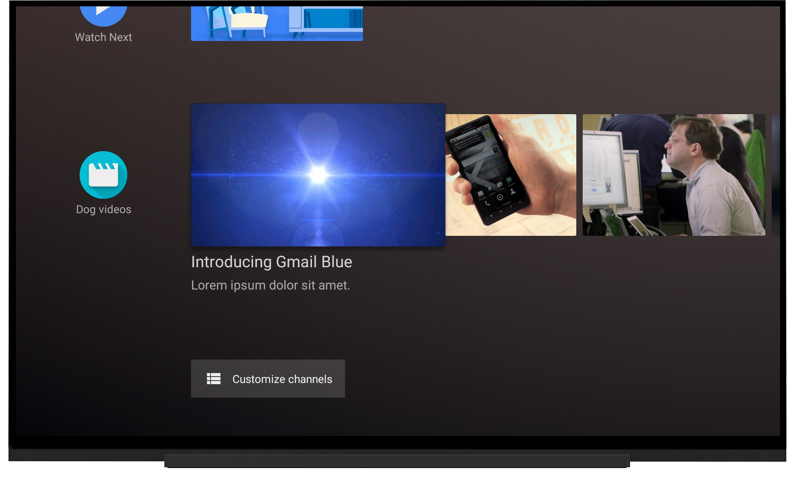
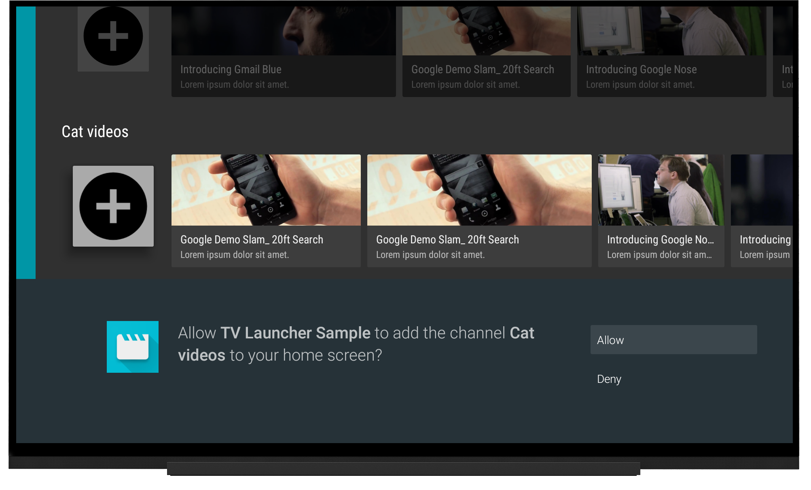
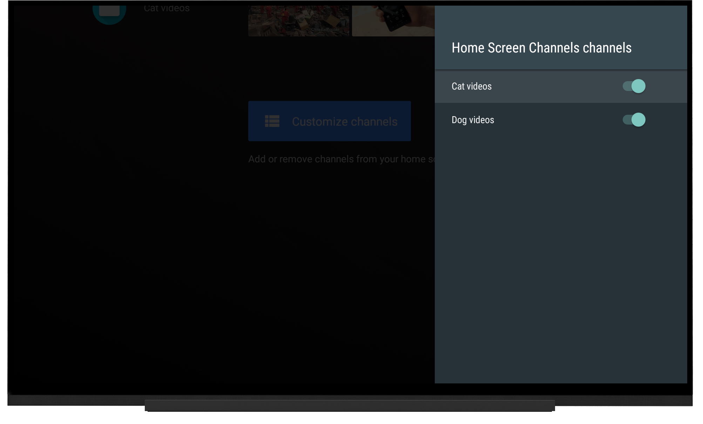

# Android TV Home Screen Channel / Programs Sample

This sample is designed to run on an Android TV device that run Android  Oreo (API 26) or higher. It demonstrates how to interact with the home screen to add channels and programs to increase user engagement.

## Introduction

This sample shows how to use `TvContractCompat` to add channels and programs to the home screen. For more information about how to integrate with the home screen, read the following:

- [Displaying Recommendations in the Android TV Home Screen](https://developer.android.com/training/tv/discovery/home-screen.html)
- [Building TV Channels](https://developer.android.com/training/tv/tif/index.html)

## Dependencies

To integrate with the home screen, you will need to add a new dependency, **support-tv-provider**. The leanback support library is also required for your app's UI and playback. 

If you use Android Studio as recommended, the following dependencies will **automatically** be installed by Gradle.

```
implementation 'com.android.support:leanback-v17:26.x.x'
implementation 'com.android.support:support-tv-provider:26.x.x'
```

## Getting Started

- Clone this repo:

```sh
git clone https://github.com/googlesamples/leanback-homescreen-channels.git
```

- Open the project in [Android Studio][studio].
- Compile and deploy to your emulator or Android TV device (such as a Nexus Player).

Need more information about getting started with Android TV? Check the [official docs][getting-started].

## Screenshots

[](https://raw.githubusercontent.com/googlesamples/leanback-homescreen-channels/master/screenshots/dog_videos.png)

[](https://raw.githubusercontent.com/googlesamples/leanback-homescreen-channels/master/screenshots/allow_channel.png)

[](https://raw.githubusercontent.com/googlesamples/leanback-homescreen-channels/master/screenshots/channel_settings.png)

[](https://raw.githubusercontent.com/googlesamples/leanback-homescreen-channels/master/screenshots/add_channel.gif)

## Support

If you need additional help, our community might be able to help.

- Android TV Google+ Community: [https://g.co/androidtvdev](https://g.co/androidtvdev)
- Stack Overflow: http://stackoverflow.com/questions/tagged/android-tv

## Contributing

We love contributions! :smile: Please follow the steps in the [CONTRIBUTING guide][contributing] to get started. If you found a bug, please file it [here][bugs].

## License

Licensed under the Apache 2.0 license. See the [LICENSE file][license] for details.

[store-apps]: https://play.google.com/store/apps/collection/promotion_3000e26_androidtv_apps_all
[studio]: https://developer.android.com/tools/studio/index.html
[getting-started]: https://developer.android.com/training/tv/start/start.html
[bugs]: https://github.com/googlesamples/androidtv-Leanback/issues/new
[contributing]: CONTRIBUTING.md
[license]: LICENSE